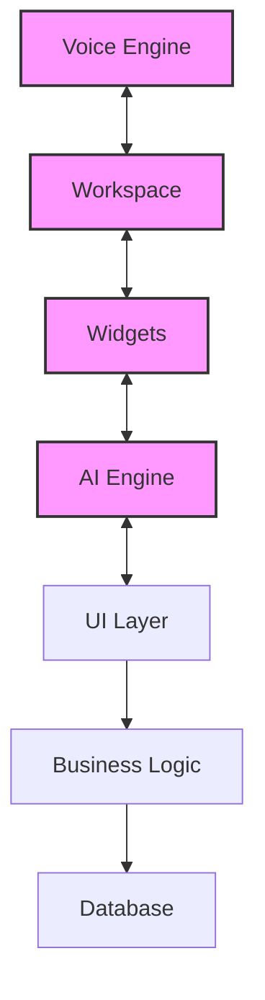
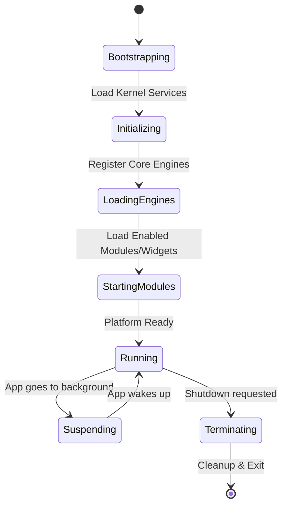
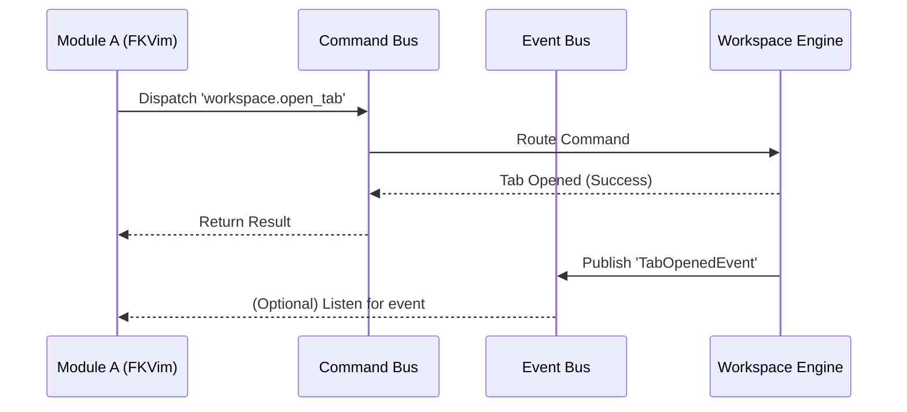
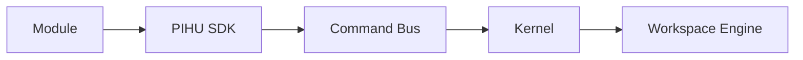
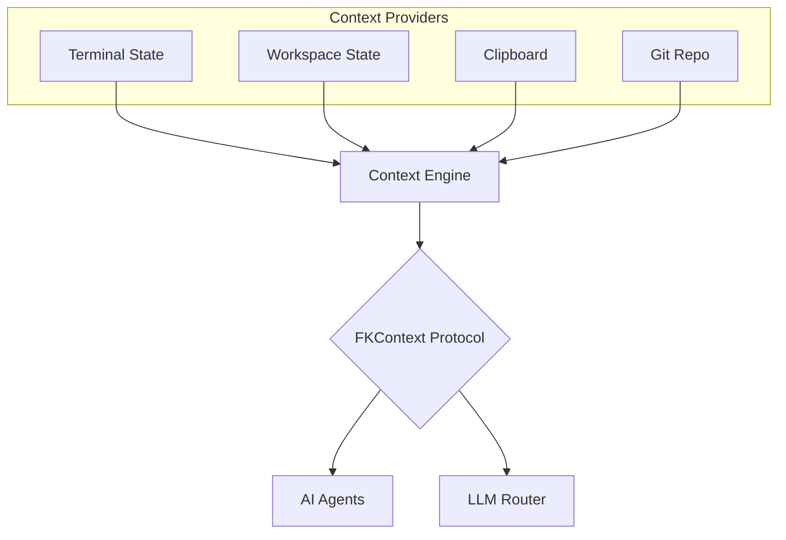
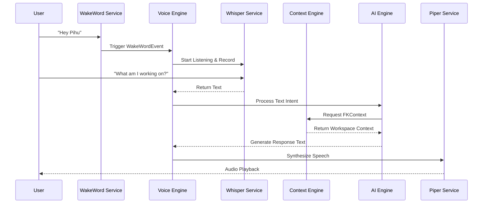

# PIHU Platform Architecture Book

**Version:** 1.0.0  
**Status:** Draft  
**Author:** PIHU Platform Team

---

## 1. Introduction

PIHU is not designed to be another desktop application. It is an **AI-native workspace platform** built as a cross-platform desktop layer on top of Windows, macOS, and Linux using Tauri + Rust + React.

The long-term vision is to create a platform where everything—from the UI itself to AI agents—is modular, replaceable, and extensible. 

Instead of building one large application, PIHU is built as a collection of independent engines communicating through a central **Kernel**.

---

## 2. Why a Kernel-Centric Architecture?

Traditional desktop applications usually evolve into tightly coupled codebases. 

### The Monolithic Problem



As features grow, the application becomes increasingly difficult to maintain. Every component eventually knows about every other component, making development slower and introducing new features riskier.

### The PIHU Solution: Kernel Architecture

PIHU avoids this by introducing a **Kernel**. The Kernel becomes the heart of the entire platform. No package communicates directly with another package; everything communicates through the Kernel.

```mermaid
graph TD
    K((Kernel))
    
    subgraph Kernel Services
        EB[Event Bus]
        CB[Command Bus]
        SR[Service Registry]
        LC[Lifecycle]
        PERM[Permissions]
        DI[Dependency Injection]
    end
    
    K --- Kernel Services

    WE[Workspace Engine] <--> K
    VE[Voice Engine] <--> K
    AE[AI Engine] <--> K
    WGE[Widget Engine] <--> K
    ME[Module Engine] <--> K

    style K fill:#ff9900,stroke:#333,stroke-width:4px
```

---

## 3. Core Goals

The architecture has six primary goals:

1. **Modularity**: Every feature exists as an independent package (e.g., Workspace Engine, Marketplace, FKVim). They can be removed without affecting unrelated parts.
2. **Extensibility**: Future developers can create Modules, Widgets, Themes, Protocols, and AI Agents without modifying the core platform.
3. **Replaceability**: Major components are replaceable (e.g., swapping OpenWakeWord for another wake word engine, or Whisper for Cloud STT) without changing the rest of PIHU.
4. **Scalability**: PIHU scales to support 100+ modules, 500+ widgets, and multiple AI models without architectural rewrites.
5. **Reusability**: Packages are reusable. The Widget Engine or Voice Engine should work independently of PIHU OS.
6. **Developer Experience**: Developers build using CLI tools (`pihu create module`) and SDKs instead of editing core source code.

---

## 4. Why a Monorepo?

PIHU consists of many interconnected packages (SDK, Kernel, Voice Engine, Marketplace, etc.). Maintaining these in separate repositories would slow down development and complicate dependency management. 

A monorepo provides:
* Shared versioning and testing.
* Consistent tooling and shared types.
* Easier cross-package refactoring.
* Simpler release management.

### Project Structure Overview

```mermaid
graph TD
    Root[PIHU Monorepo]
    
    Root --> Apps[apps/]
    Apps --> OS[PIHU OS]
    Apps --> MP[Marketplace]
    Apps --> Installer
    Apps --> Docs
    
    Root --> Pkgs[packages/]
    Pkgs --> Kernel
    Pkgs --> Engines
    Pkgs --> UI[UI/Theme]
    
    Root --> Mods[modules/]
    Mods --> FKVim
    Mods --> Browser
    Mods --> Notes
    
    Root --> Wgts[widgets/]
    Wgts --> Clock
    Wgts --> Weather
    Wgts --> Sysmon
    
    Root --> Prots[protocols/]
    Prots --> FKContext
    Prots --> MCP
    Prots --> LSP
    
    Root --> Agts[agents/]
    Agts --> Research
    Agts --> Coder
    
    Root --> Svcs[services/]
    Svcs --> WakeWord
    Svcs --> Whisper
    Svcs --> Sync
    
    Root --> Tools[tools/]
    Tools --> CLI
    Tools --> Generators
```



---

## 5. The Kernel Deep Dive

The Kernel is the heart of PIHU. Everything depends on it, and it provides crucial platform services.

### 5.1 Lifecycle Manager
Manages application startup, shutdown, initialization, and package loading.



### 5.2 Event Bus & Command Bus
* **Event Bus**: Broadcasts asynchronous events (`WorkspaceOpened`, `ModuleInstalled`, `WakeWordDetected`).
* **Command Bus**: Executes synchronous or asynchronous commands (`workspace.open()`, `voice.start()`).



### 5.3 Service Registry & Dependency Injection
Packages register services, and other packages request them. The Kernel creates and manages dependencies—packages never construct each other directly.

### 5.4 Permissions Validator
Every module declares permissions (`Filesystem`, `Microphone`, `AI`). The Kernel validates these permissions before execution.

---

## 6. Modules and the SDK

Modules are applications that must communicate through the **PIHU SDK**, never directly with the Kernel's internal APIs or other modules.


*This keeps the system loosely coupled and highly secure.*

---

## 7. FKContext & Context Engine

**FKContext** is PIHU’s native context protocol. Rather than collecting context separately for every feature, FKContext becomes the universal context provider. It aggregates:
* Current Workspace & Open Tabs
* Clipboard & Selected Text
* Conversation History & Memory Stack
* Terminal & Browser States
* Git Repository



---

## 8. Voice & AI Pipeline Architecture

The Voice Engine and AI Engine follow the same strict decoupling. 



---

## 9. Marketplace

The Marketplace distributes Modules, Widgets, Themes, Protocols, Agents, Voice Models, and AI Models. Everything should be installable dynamically without rebuilding or modifying PIHU itself.

---

## 10. Development Roadmap

### Phase 1: Core Foundation
* Kernel & SDK
* Workspace Engine, Panel Engine, Tab Engine, Layout Engine
* Module Engine
* Theme & UI

### Phase 2: Voice Intelligence
* Voice Engine
* Wake Word, VAD (Voice Activity Detection)
* Speech Recognition & TTS
* Intent Detection

### Phase 3: Context & AI Processing
* Context Engine & FKContext
* Memory & Prompt Builder
* Planning & LLMs

### Phase 4: Ecosystem Growth
* Marketplace
* Widgets, Themes, Protocols
* Module Distribution pipeline

### Phase 5: Autonomous Agents
* AI Agents & Automation
* Knowledge Graph
* Multi-Agent Collaboration

---

## 11. Core Philosophy

Everything in PIHU should follow one rule: **If something can become a plugin, it should not live inside the core.**

The Kernel remains small. Everything else becomes an Engine, Module, Widget, Protocol, or Service. This philosophy ensures PIHU remains modular, extensible, maintainable, and future-proof as the platform evolves.

---

## 12. Current Implementation (Phase 1)

As of the current iteration, we are successfully laying the foundation defined in **Phase 1: Core Foundation**. The following components are live and integrated within the codebase:

1. **Monorepo Structure**: Fully configured `pnpm` workspaces mapping out `apps/`, `packages/`, `modules/`, `widgets/`, and `protocols/`. Driven by Turborepo for fast, cached builds.
2. **The Kernel (`packages/kernel`)**: 
   - Scaffolding of the core `Kernel` instance alongside working interfaces for the `EventBus`, `CommandBus`, and `ServiceRegistry`.
3. **Layout & Type Definitions (`packages/types`, `packages/layout-engine`)**:
   - Centralized `LayoutNode`, `PanelNode`, and `SplitNode` definitions providing a universal JSON structure to represent workspace states.
4. **React Layout Engine (`packages/ui`)**:
   - A recursive `LayoutRenderer` component utilizing `react-resizable-panels`. It accurately translates the JSON node structure into a real, resizable UI.
5. **PIHU OS Desktop (`apps/pihu-os`)**:
   - A Tauri V2 Application containing a Vite + React frontend. 
   - It seamlessly renders a hardcoded default workspace tree to demonstrate the horizontal split rendering behavior (e.g., separating an FKVim node and an FKTerm node).
