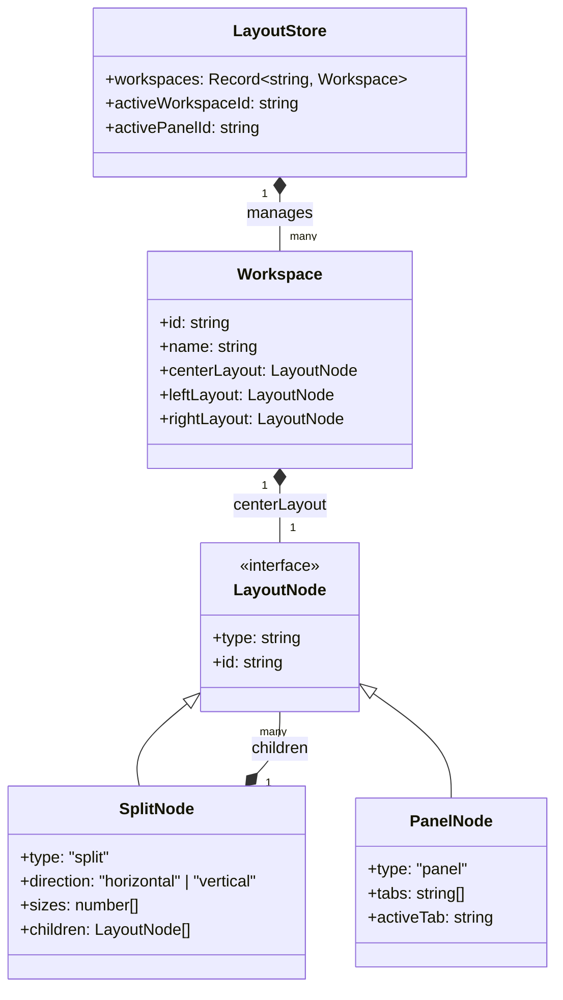
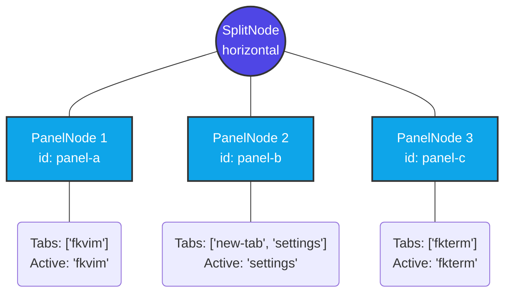

# PihuOS Workspace Architecture

This document outlines how workspaces, layouts, panels, and tabs function within PihuOS, including how the layout tree is structured, visually represented, and stored in memory.


---

## 1. Architectural Overview

At the core of PihuOS's window management is a hierarchical tree structure. The architecture is designed to be fully serializable, meaning the entire UI state can be converted into a JSON string and restored seamlessly.



---

## 2. How the Layout Tree Works

The layout engine uses a recursive structure made up of **SplitNodes** and **PanelNodes**.

### SplitNode (The Container)
A `SplitNode` divides the available space either horizontally (left-to-right) or vertically (top-to-bottom). It acts as an invisible container that holds other nodes.
- `sizes`: An array of percentages dictating how much space each child takes (e.g., `[33, 33, 34]`).
- `children`: An array of nested `LayoutNode` objects (can be panels or more splits).

### PanelNode (The Window)
A `PanelNode` is a leaf node in the tree. It represents a physical, resizable window pane on the screen that actually contains content.
- `tabs`: An array of string identifiers representing the tabs open inside this specific panel.
- `activeTab`: The currently selected tab being displayed.

### Example: The Layout in `workspace1.png`

Let's break down how the specific layout shown in `workspace1.png` is translated into our data structure. In the image, the center layout consists of three vertical columns: `fkvim`, `settings` (inside a new-tab), and `fkterm`.

Here is how that exact layout is stored as a tree in memory:



**JSON Representation of `workspace1.png` Center Layout:**
```json
{
  "type": "split",
  "id": "split-root",
  "direction": "horizontal",
  "sizes": [33.3, 33.3, 33.4],
  "children": [
    {
      "type": "panel",
      "id": "panel-fkvim",
      "tabs": ["fkvim"],
      "activeTab": "fkvim"
    },
    {
      "type": "panel",
      "id": "panel-settings",
      "tabs": ["new-tab", "settings"],
      "activeTab": "settings"
    },
    {
      "type": "panel",
      "id": "panel-fkterm",
      "tabs": ["fkterm"],
      "activeTab": "fkterm"
    }
  ]
}
```

---

## 3. Panels, Tabs, and Layout Rendering

- **Rendering**: The `LayoutRenderer` component recursively walks down the JSON tree. 
  - For every `SplitNode`, it uses `react-resizable-panels` to render a `PanelGroup` that allows the user to drag and resize the divisions.
  - For every `PanelNode`, it renders a physical UI window containing a tab header and the active tab's content.
- **Splitting**: When you split a panel (e.g., vertically), the layout engine replaces the target `PanelNode` with a new `SplitNode` (direction: vertical) containing the original panel and a new empty panel next to it.
- **Closing Tabs**: When you close a tab, it is removed from the panel's `tabs` array. If a panel becomes completely empty (0 tabs), the layout engine cleans up the layout tree by deleting the `PanelNode` and merging the remaining space back into its siblings.

---

## 4. State Management and Storage

The entire layout state is centrally managed by a **Zustand store** located in `@pihu/layout-engine` (`LayoutStore.ts`).

### Immutable State Operations
The store (`useLayoutStore`) holds a dictionary of all initialized `workspaces`. When you perform operations like `splitPanel`, `closeTab`, or `navigateFocus`, the engine:
1. Deep-clones the active workspace's JSON layout tree.
2. Traverses the tree to find the targeted `PanelNode`.
3. Performs the necessary structural mutations (adding splits, removing tabs).
4. Commits the new tree immutably to the Zustand state.

### Persistence
Because the UI structure is completely decoupled from the React component lifecycle and exists purely as a highly structured JSON tree (as shown in the `workspace1.png` example), **the entire state can be stringified**.

When PihuOS closes, this JSON object is saved directly to the disk (via Tauri's file system or `localStorage`). Upon restarting, the JSON is loaded back into the Zustand store, perfectly reconstructing your workspaces, split proportions, and open tabs exactly as you left them.
